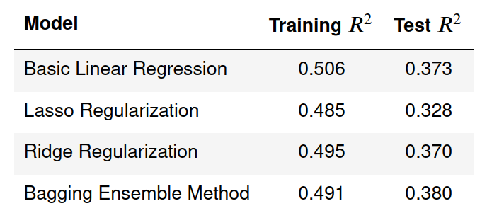

# [Wordle Difficulty Analysis](https://github.com/vcgregoric/Wordle_Analysis)
This project is an attempt to develop a machine learning model to predict the difficulty of solving a Wordle puzzle given the answer word. The data for this projects comes from the following sources:
- [https://twitter.com/WordleStats](https://twitter.com/WordleStats)
- [https://wordfinder.yourdictionary.com/wordle/answers/](https://wordfinder.yourdictionary.com/wordle/answers/)
- [https://github.com/IlyaSemenov/wikipedia-word-frequency/tree/master](https://github.com/IlyaSemenov/wikipedia-word-frequency/tree/master)
- [https://en.wikipedia.org/wiki/Letter_frequency](https://en.wikipedia.org/wiki/Letter_frequency)

A slide deck summarizing the results of this project can be found [here](https://github.com/vcgregoric/Wordle_Analysis/blob/main/summary_slides.pdf).

  
# [Electric Vehicles on the Rise](https://github.com/vcgregoric/Electric_Vehicle_Analysis)
This project is an exploration of how electric vehicles (EV) have changed over the past decade. The data for this projects comes from the following sources:
- [Argonne National Laboratory Light Duty Electric Drive Vehicles Monthly Sales Updates](https://www.anl.gov/esia/light-duty-electric-drive-vehicles-monthly-sales-updates)
- [US Department of Energy Alternative Fueling Station Locator](https://afdc.energy.gov/stations/#/find/nearest)
- [US Department of Energy Find a Car Power Search](https://www.fueleconomy.gov/feg/powerSearch.jsp)

The final Tableau project can be found on Tableau Public [here](https://public.tableau.com/app/profile/vcgregoric/viz/ElectricVehiclesontheRise/ElectricVehicleDashboard).

