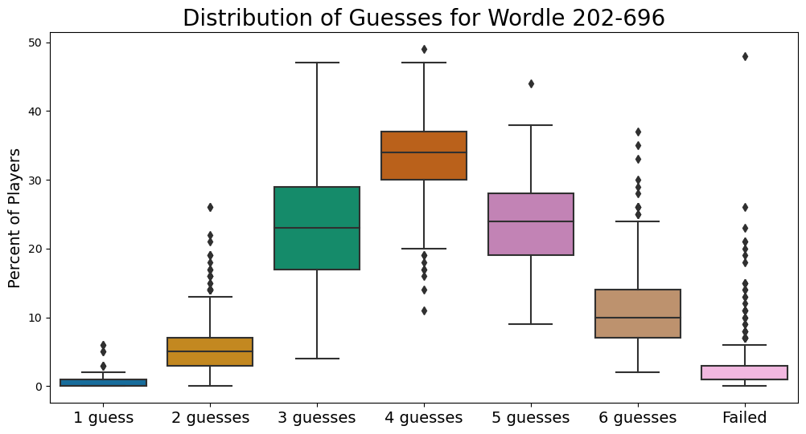
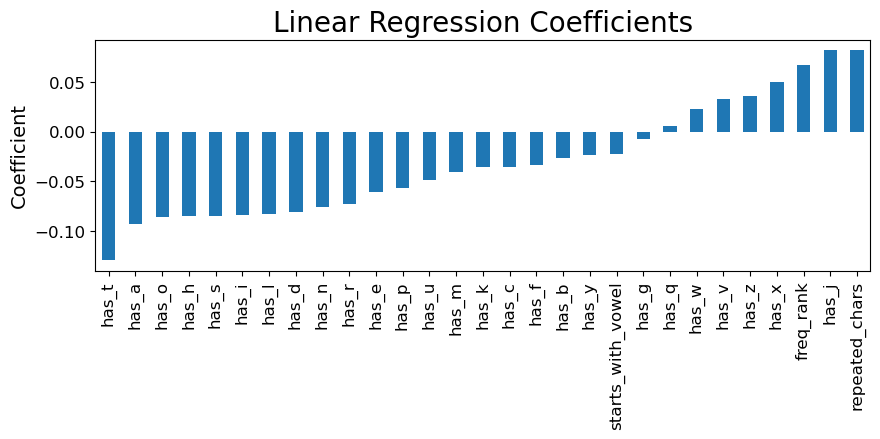

# [Wordle Difficulty Analysis](https://github.com/vcgregoric/Wordle_Analysis)
This project is an attempt to develop a machine learning model to predict the difficulty of solving a Wordle puzzle given the answer word. The data for this projects comes from the following sources:
- [https://twitter.com/WordleStats](https://twitter.com/WordleStats)
- [https://wordfinder.yourdictionary.com/wordle/answers/](https://wordfinder.yourdictionary.com/wordle/answers/)
- [https://github.com/IlyaSemenov/wikipedia-word-frequency/tree/master](https://github.com/IlyaSemenov/wikipedia-word-frequency/tree/master)
- [https://en.wikipedia.org/wiki/Letter_frequency](https://en.wikipedia.org/wiki/Letter_frequency)

A slide deck summarizing the results of this project can be found [here](https://github.com/vcgregoric/Wordle_Analysis/blob/main/summary_slides.pdf).

